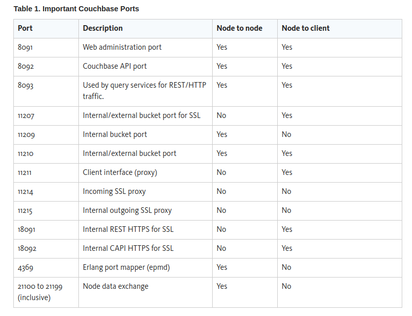

## Ports 

## Block Device / Storage

## Disk throughput and sizing

Couchbase Server decouples RAM from the I/O layer to enable high scaling.

Decoupling enables high scaling at very low and consistent latencies and very high write loads without affecting the client application performance.

Couchbase Server implements an append-only format and a built-in automatic compaction process. Requirements of your disk subsystem are broken down into two components: size and I/O.

## Disk size requirements
Default configuration requires 2 agent nodes each with: 1.0 CPU | 4096 MB MEM | 1 15360 MB Disk

Disk size requirements are impacted by the Couchbase file write format, append-only, and the built-in automatic compaction process. Append-only format means that every write (insert/update/delete) creates a new entry in the file(s).

The required disk size increases from the update and delete workload and then shrinks as the automatic compaction process runs. The size increases because of the data expansion rather than the actual data using more disk space. Heavier update and delete workloads increases the size more dramatically than heavy insert and read workloads.
